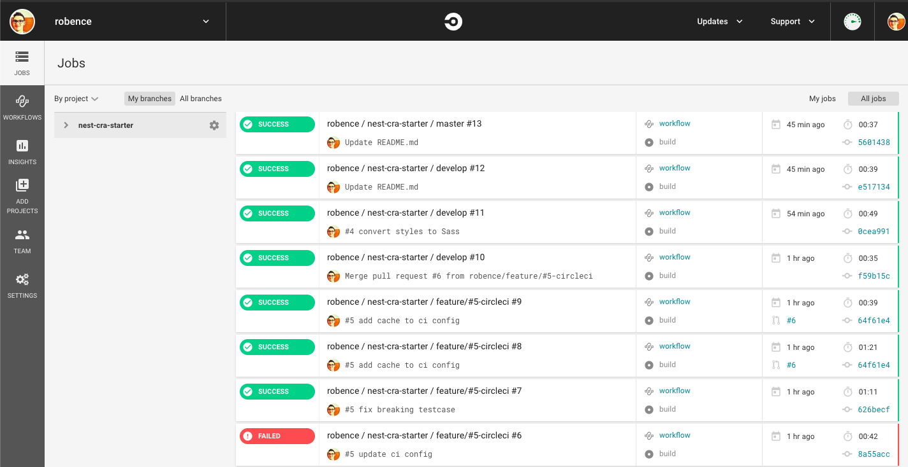
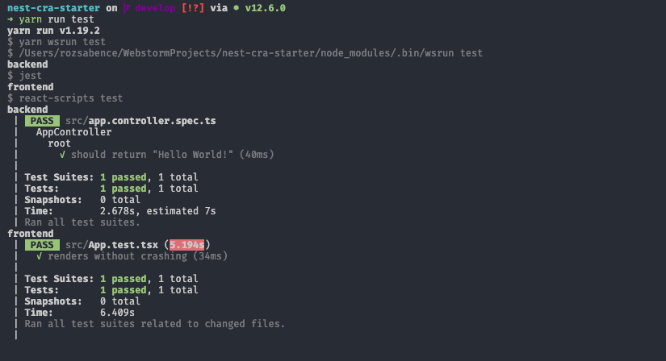
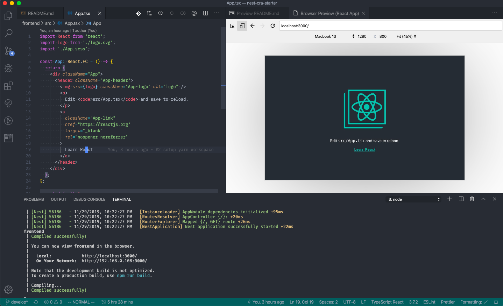

## Nest.js & Create React App Fullstack Example

### Aims

    This project's aim to speed up creating new fullstack projects.

### Give it a try

`$ git clone git@github.com:robence/nest-cra-starter.git`

`$ cd nest-cra-starter`

`$ yarn dev`

### Features

- Fullstack Typescript - you can use types everywhere
- CI support via CircleCI running tests
- Precommit checks ESLint and Typescript errors

### Used technologies:

- <b>Structure</b>: Yarn workspace
  - <b>Backend</b>: Nest.js
  - <b>Frontend</b>: Create React App
- <b>Language</b>: Typescript
- <b>Linter</b>: Eslint
- <b>Formatter</b>: Prettier

### Images

#### CircleCI

#### Tests

#### App

